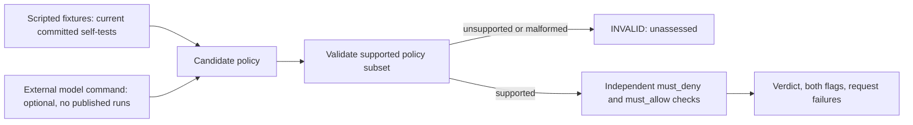

# iam-remediation-eval

An offline IAM remediation evaluator that checks two separate questions: does a proposed policy block the prohibited requests, and does it preserve the specified workload?

**Two kinds of results are published here and they must not be confused.** The *scripted self-tests* ([report](results/report.md)) use five hand-written fixtures, including policies read straight from the answer key; they validate the evaluator and say nothing about any model. The *measured model run* ([report](results/model_runs/REPORT.md)) is a real evaluation of three Mistral models over all ten cases on 8 September 2026, with prompts, raw responses and request digests committed. Each model is run in two conditions: the workload disclosed as exact action/resource pairs, and the same workload described in prose so the model must infer the permissions. Across 14 cases the models score 7 to 10 correct, and every failure is on GCP. `ministral-3b` produced the only **unsafe** results, twice, by proposing `roles/iam.serviceAccountUser` — a real role that drops token minting but keeps `iam.serviceAccounts.actAs`, so the impersonation survives. The remaining GCP failures split three ways: a permission written into the role field, a `roles/custom` placeholder, and roles invented by completing a real naming pattern such as `iam.serviceAccountKeyViewer`. Role identifiers are [checked against Google's published reference](results/model_runs/gcp_role_verification.md) rather than assumed. Correct counts are not a model ranking: the conditions were run once each at temperature 0 and the differences are a few cases wide.

This student project contains fourteen hand-written AWS/GCP cases and a deliberately limited policy evaluator. Passing means satisfying these finite assertions within that model; it does not prove production safety, complete least privilege, or a working cloud workload.

## Safety and workload integrity

| | Workload intact | Workload broken |
| --- | --- | --- |
| Tested requests blocked | CORRECT | BROKEN |
| A prohibited request allowed | UNSAFE | UNSAFE, with `is_intact=false` |

`must_deny.json` and `must_allow.json` are evaluated independently. Both sets of failures are retained. The single verdict gives UNSAFE priority when both dimensions fail. Malformed or unsupported policies return INVALID before grading; their false flags are placeholders for unassessed dimensions, and they are excluded from the matrix counts.

Each `must_deny` request is prohibited individually. These assertions do **not** execute or model the conjunction of steps in an attack chain. A policy that removes one step but retains another may therefore be marked unsafe even when that particular chain is no longer executable.

## Current architecture



For supported AWS statements, action, resource, and condition must all match. A matching explicit Deny overrides matching Allows, in either statement order. Without a matching Allow, the request is denied.

## Supported subset and refusal boundaries

- AWS identity-policy statements: `Sid`, `Effect`, `Action`, `Resource`, `Condition`. Actions ignore case; resources preserve case. Wildcards support `*` and `?`; brackets are literal. Empty statement lists represent deny-all fixtures.
- Conditions: exactly `StringEquals`, `StringLike`, `StringNotEquals`, `ArnEquals`, and `ArnLike`. Condition keys ignore case; values preserve case. Multiple expected positive values use OR; `StringNotEquals` uses NOR. A missing key fails positive comparisons and satisfies `StringNotEquals`. Multiple keys/operators use AND. ARN comparisons support wildcards.
- Request condition values must be scalar strings. Set qualifiers, `IfExists`, policy variables, `Bool`, IP/numeric/date operators and all other operators return INVALID. Malformed condition blocks also return INVALID, even on statements that would not match a request. The direct condition helper raises `ValueError`.
- `Principal`, `NotPrincipal`, `NotAction`, `NotResource`, and unknown policy fields are rejected rather than ignored. This validator checks the supported structure, not all AWS service-specific policy rules.
- GCP supports the eight role names in `GCP_ROLE_PERMISSIONS` and explicit `user:` / `serviceAccount:` members. Unknown roles, conditional bindings, groups, public principals and wildcard members return INVALID. Every request needs an explicit member. Permissions are case sensitive.

The condition contract follows [AWS condition operators](https://docs.aws.amazon.com/IAM/latest/UserGuide/reference_policies_elements_condition_operators.html) and [multiple-value logic](https://docs.aws.amazon.com/IAM/latest/UserGuide/reference_policies_condition-logic-multiple-context-keys-or-values.html) for the subset above.

## Cases

| Case | Prohibited capability | Preserved workload |
| --- | --- | --- |
| [01](cases/01-passrole-runinstances) | PassRole / RunInstances | Existing fleet inspection and start/stop |
| [02](cases/02-createpolicyversion) | CreatePolicyVersion | Policy compliance inspection |
| [03](cases/03-passrole-lambda) | PassRole / CreateFunction | Update an existing function's code |
| [04](cases/04-attachuserpolicy) | AttachUserPolicy | Directory enumeration |
| [05](cases/05-createaccesskey) | Other users' access-key management | Create/delete and inspect own keys |
| [06](cases/06-updateassumerolepolicy) | Trust-policy modification | Assume a designated staging role |
| [07](cases/07-setdefaultpolicyversion) | SetDefaultPolicyVersion | Policy inventory |
| [08](cases/08-s3-wildcard) | Unscoped S3 access | Read/write designated assets |
| [09](cases/09-gcp-actas-cloudfunctions) | ActAs / function creation | Function inspection |
| [10](cases/10-gcp-set-iampolicy) | Project IAM policy modification | Project IAM inspection |

Each directory contains the original policy, positive/negative requests, a reference remediation, and notes. The references are known-good **for these checks**, not independently certified policies. Case 05 includes self-key creation/deletion checks; the earlier version tested only inspection despite describing rotation.

## Scripted oracle self-tests

See [the generated report](results/report.md), [structured results](results/self_test_eval.json), and [per-fixture artifacts](results/raw). Every artifact records fixture provenance and the candidate policy text. No model is called.

| Fixture | Construction | Expected purpose |
| --- | --- | --- |
| `reference_policy_check` | Reads `reference_remediation.json` | Answer-key acceptance sanity check |
| `unchanged_policy_fixture` | Returns original permissions | Unsafe classification check |
| `deny_all_fixture` | Removes all access | Workload failure check |
| `malformed_json_fixture` | Emits fixed malformed text | Parse failure check |
| `mixed_outcome_fixture` | Seven answer-key policies, two originals, one broken policy | Mixed report aggregation check |

The old names `reference_expert` and `heuristic_zeroshot` implied capabilities these fixtures do not have. Their scores were never evidence about experts, heuristics, or language models.

## Verification and mutation testing

Python 3.9+ and the standard library are sufficient. CI runs Python 3.9–3.13.

```bash
python3 -m unittest discover tests -v
python3 scripts/run_mutations.py
python3 scripts/validate_repo.py
python3 scripts/run_self_tests.py
python3 scripts/run_oracle.py --case 01-passrole-runinstances --policy cases/01-passrole-runinstances/reference_remediation.json --json
```

Validation recomputes and compares **all** committed self-test JSON, raw records, and the Markdown report. It does not rewrite them. To intentionally regenerate after a change:

```bash
python3 scripts/run_self_tests.py --write
```

The mutation harness applies 12 single-site source mutations in isolated namespaces: Deny precedence, conditions, default deny, safety aggregation, resource scoping, action case, wildcard expansion, literal brackets, unsupported operator dispatch, negated values, GCP role expansion, and member scoping. Every mutation site must exist exactly once; stale sites and crashing mutants fail the audit. Synthetic probes assert independent expected verdicts before comparison.

Current result: **12/12 selected mutants killed**. This is coverage of this curated set, not 100% defect coverage or proof of IAM correctness. The original six-mutant harness included false confidence: two AWS mutations were killed by inappropriate GCP parsing, while the case-sensitivity mutation also removed wildcard behavior. Those implementations have been replaced.

## Recording a real model run

`scripts/evaluate_model.py` invokes a provider adapter command once per case. Your adapter must read a JSON `messages` object from stdin, call the chosen model, and write only the candidate policy text to stdout. Use an absolute adapter path; it runs from a temporary empty working directory. Provider credentials belong in the environment, not command arguments or configuration artifacts.

```bash
python3 scripts/evaluate_model.py \
  --provider YOUR_PROVIDER --model EXACT_MODEL_VERSION \
  --config '{"temperature":0}' --output /tmp/iam-model-run-001 \
  --command /absolute/path/to/your-provider-adapter
```

This example requires your own provider adapter; none is bundled or silently selected. `--config` records parameters and does not configure the adapter: the adapter must apply the same settings. Model identity is caller-declared, not independently attested.

The runner records prompts, raw responses, grades, UTC timestamps, model/config labels, git revision, dirty status, and input/source hashes. It refuses to overwrite existing run directories, flushes each record, and distinguishes command failures/timeouts from invalid policy output. No automatic repair or retry changes the response.

Prompts contain the original policy and structured workload requirements from `must_allow`. They exclude attack checks, notes, and reference policies. Thus workload checks are disclosed constraints, not held-out generalization tests. An empty working directory is **not** a filesystem sandbox; the adapter is trusted not to read answer keys. Publishing results additionally requires confirming the command actually called the declared model, documenting sampling/repeats and costs, and retaining provider evidence. Test adapters used by unit tests are not LLM runs.

## Limitations

- Ten public, hand-written cases are a small, exposed test set. There is no hidden split, contamination control, or statistically supported model ranking.
- GCP role expansion is loaded from [`oracle/data/gcp_roles.json`](oracle/data/gcp_roles.json). Fourteen predefined roles carry the permission lists exactly as published on Google's roles-and-permissions reference, retrieved 8 September 2026 with the source URL recorded per role. The basic roles `roles/editor` and `roles/viewer` grant thousands of permissions across every service, cannot be enumerated here, and remain approximations flagged `verified: false` — a deny attributed to those two entries is not evidence the real role lacks the permission. `roles/owner` is modelled as `*`. A role absent from the file is reported INVALID, which means unmodelled, not non-existent. The evaluator still does not model resource hierarchy, group membership, deny policies, or CEL. A policy is assumed attached at the case's project scope; request resource strings are not used to resolve binding inheritance.
- AWS evaluation omits policy combination, resource policies, SCPs, permission boundaries, trust evaluation, session policies, service-specific action/resource compatibility, ARN-segment rules and cloud-side state. Supported wildcard matching is a simplified string model.
- Workload permission checks do not execute workloads. Multi-step attacks require additional state and permissions; denying individual listed requests is a conservative case contract, not an exploitability proof. In case 03, allowing code updates also assumes the existing function's role is appropriate; that role is outside the policy being graded.
- INVALID includes valid cloud policies that this limited oracle cannot understand. Do not report every INVALID result as a model syntax error.
- No cloud simulation cross-check or live provider-model evaluation has been performed for the committed self-test report. Regression and mutation tests improve evidence about the implementation without establishing full cloud equivalence.
