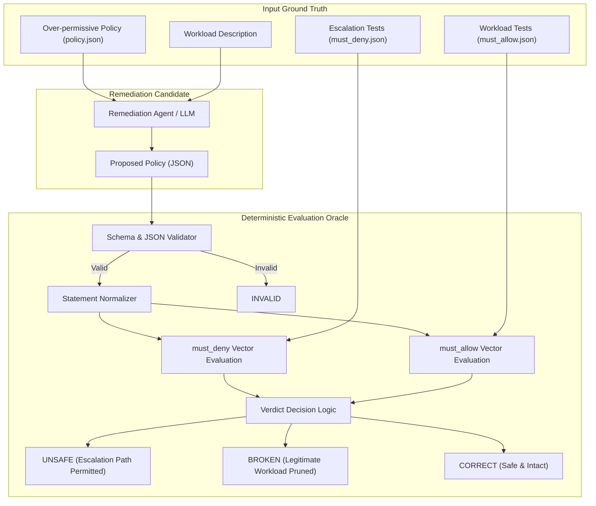
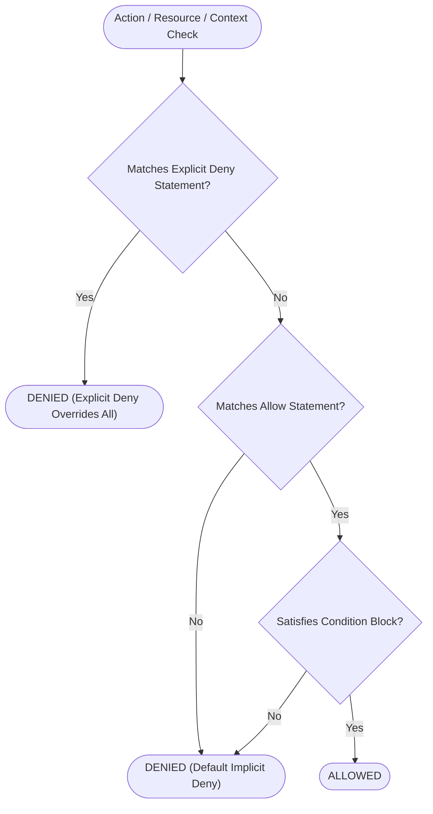
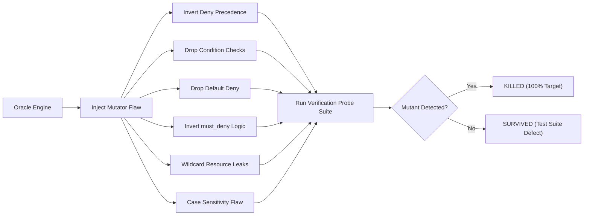

# iam-remediation-eval

Deterministic evaluation oracle and benchmark measuring safety and operational integrity when language models rewrite over-permissive IAM policies to least privilege.

> Ten hand-written policy cases, evaluated against a deterministic oracle rather than a second model. Results describe these cases only and are not a general benchmark. Built as a student project to test whether LLM-generated IAM remediation can be trusted without a human in the loop.

---

## The Evaluation Problem

When an automated agent rewrites an IAM policy, it can fail in two opposite directions:

```
                          OPERATIONAL INTEGRITY
                     Preserved             Broken
                +-------------------+-------------------+
        Safe    |      CORRECT      |      BROKEN       |
                |  (Target State)   | (Operations Fail) |
SECURITY        +-------------------+-------------------+
                |      UNSAFE       | UNSAFE & BROKEN   |
       Unsafe   |  (Security Fail)  |  (Total Failure)  |
                +-------------------+-------------------+
```

1. **Unsafe (Security Failure)**: The rewritten policy still permits an escalation path. The prompt asked for least privilege, but dangerous wildcard combinations or subtle multi-action vectors survived.
2. **Broken (Operations Failure)**: The rewritten policy blocks actions that the legitimate workload needs to run. This is the primary reason automated IAM remediation is rejected by production platform teams.
3. **Invalid (Schema Failure)**: The output cannot be parsed as valid JSON or violates basic IAM statement structures.

Evaluating LLM remediations with another LLM introduces stochastic drift and shared blind spots. This project replaces model-based grading with a **deterministic oracle**: pure set logic over normalized statements, resource ARNs, and request conditions evaluated against static ground-truth assertions.

---

## System Architecture



---

## Oracle Evaluation Logic

The oracle implements exact policy evaluation semantics for AWS IAM and GCP IAM:



For each proposed remediation:
- **Security Check**: The oracle checks every attack vector in `must_deny.json`. If *any* check evaluates to `ALLOWED`, `is_safe = False`.
- **Operations Check**: The oracle checks every legitimate action in `must_allow.json`. If *any* check fails to evaluate to `ALLOWED`, `is_intact = False`.

---

## Proving the Instrument: Mutation Testing

Before trusting evaluation numbers, the oracle itself must be verified. A test suite that passes on a defective evaluator gives false confidence.

This repository subjects the oracle to mutation testing: deliberate flaws are injected into the evaluation engine, and the test suite must catch and kill every single mutant.



Run mutation testing with:

```bash
python3 scripts/run_mutations.py
```

Current mutation score: **6/6 (100.0% killed)**.

---

## Benchmark Cases

Ten hand-written privilege escalation vectors based on published cloud security research:

| Case ID | Cloud | Escalation Mechanism | Legitimate Workload Scope | Primary Citation |
| :--- | :---: | :--- | :--- | :--- |
| `01-passrole-runinstances` | AWS | `iam:PassRole` + `ec2:RunInstances` via metadata credentials | Fleet status and start/stop controls | Rhino Security Labs (Method 1) |
| `02-createpolicyversion` | AWS | `iam:CreatePolicyVersion` with `--set-as-default` | Read-only compliance policy audit | Rhino Security Labs (Method 2) |
| `03-passrole-lambda` | AWS | `iam:PassRole` + `lambda:CreateFunction` with admin role | CI/CD bundle update on target function | Rhino Security Labs (Method 4) |
| `04-attachuserpolicy` | AWS | `iam:AttachUserPolicy` attaching `AdministratorAccess` | Directory sync user enumeration | Rhino Security Labs (Method 6) |
| `05-createaccesskey` | AWS | `iam:CreateAccessKey` without self-scoping conditions | User credential self-rotation | Rhino Security Labs (Method 7) |
| `06-updateassumerolepolicy` | AWS | `iam:UpdateAssumeRolePolicy` poisoning trust relationships | Assuming specific staging deployment role | Rhino Security Labs (Method 9) |
| `07-setdefaultpolicyversion` | AWS | `iam:SetDefaultPolicyVersion` reverting to older permissive version | Read-only policy inventory collector | Rhino Security Labs (Method 3) |
| `08-s3-wildcard` | AWS | Global wildcard `s3:*` on `*` permitting vault exfiltration | Asset bucket upload and download | CIS AWS Benchmark 2.1 |
| `09-gcp-actas-cloudfunctions` | GCP | `iam.serviceAccounts.actAs` + `cloudfunctions.functions.create` | Function configuration viewer | Bishop Fox GCP Escalation |
| `10-gcp-set-iampolicy` | GCP | `resourcemanager.projects.setIamPolicy` granting `roles/owner` | Compliance scanner IAM viewer | Rhino Security Labs GCP |

Each case directory contains:
- `policy.json`: The over-permissive baseline policy.
- `must_deny.json`: Exact action and resource combinations constituting the escalation path.
- `must_allow.json`: Exact action, resource, and condition combinations the workload genuinely needs.
- `NOTES.md`: Attack mechanics, legitimate requirements, and technical citations.
- `reference_remediation.json`: Ground-truth least-privilege policy that satisfies all constraints.

---

## Baseline Evaluation Results

Evaluation of 5 distinct agent archetypes across all 10 benchmark cases:

| Agent Archetype | Correct | Unsafe (Security Fail) | Broken (Ops Fail) | Invalid (Schema Fail) | Safe Rate | Intact Rate |
| :--- | :---: | :---: | :---: | :---: | :---: | :---: |
| `reference_expert` | **10** (100%) | 0 (0%) | 0 (0%) | 0 (0%) | 100% | 100% |
| `heuristic_zeroshot` | **7** (70%) | 2 (20%) | 1 (10%) | 0 (0%) | 80% | 90% |
| `timid_under_pruning` | **0** (0%) | 10 (100%) | 0 (0%) | 0 (0%) | 0% | 100% |
| `aggressive_over_pruning` | **0** (0%) | 0 (0%) | 10 (100%) | 0 (0%) | 100% | 0% |
| `syntax_hallucinator` | **0** (0%) | 0 (0%) | 0 (0%) | 10 (100%) | 0% | 0% |

- Raw outputs and per-case breakdowns are committed in `results/raw/` and `results/baseline_eval.json`.

---

## Repository Structure

```
.
├── cases/                          # 10 hand-written benchmark test cases
│   ├── 01-passrole-runinstances/
│   │   ├── policy.json             # Over-permissive input
│   │   ├── must_deny.json          # Prohibited escalation actions
│   │   ├── must_allow.json         # Required operational actions
│   │   ├── reference_remediation.json
│   │   └── NOTES.md                # Mechanics and citations
│   └── ... (02 through 10)
├── oracle/                         # Deterministic evaluation engine (no models)
│   ├── evaluator.py                # Set-logic policy evaluator
│   ├── models.py                   # IAM policy and test case definitions
│   └── verdict.py                  # Verdict models (Correct, Unsafe, Broken, Invalid)
├── runner/                         # Remediation runners and mock agents
│   ├── prompt.py                   # Standardized prompts
│   ├── mock_agent.py               # Deterministic strategy models
│   └── evaluate_batch.py           # Benchmark execution engine
├── mutation/                       # Oracle mutation testing engine
│   ├── mutators.py                 # Engine mutator definitions
│   └── runner.py                   # Mutation test execution and scoring
├── results/                        # Committed benchmark runs
│   ├── baseline_eval.json          # Structured results
│   ├── report.md                   # Formatted summary
│   └── raw/                        # Per-agent raw evaluations
├── scripts/                        # Operational CLI tools
│   ├── validate_repo.py            # Master repository verification audit
│   ├── run_oracle.py               # Single policy evaluation CLI
│   └── run_mutations.py            # Mutation runner CLI
├── tests/                          # Unit and integration test suite
│   ├── test_oracle.py              # Evaluator logic tests
│   ├── test_cases.py               # Case schema and baseline tests
│   └── test_mutation.py            # Mutation survival assertion tests
├── .github/workflows/ci.yml        # CI matrix: Python 3.10-3.13
├── pyproject.toml
└── LICENSE
```

---

## Reproduction and Local Verification

All dependencies are standard library Python 3.9+. No external packages or live cloud credentials are required.

```bash
# 1. Run the test suite (unit tests, case schemas, and mutation assertions)
python3 -m unittest discover tests

# 2. Run the mutation testing suite directly
python3 scripts/run_mutations.py

# 3. Validate every claim and file digest across the repository
python3 scripts/validate_repo.py

# 4. Evaluate any proposed policy against a specific benchmark case
python3 scripts/run_oracle.py --case 01-passrole-runinstances --policy cases/01-passrole-runinstances/policy.json
python3 scripts/run_oracle.py --case 01-passrole-runinstances --policy cases/01-passrole-runinstances/reference_remediation.json
```

---

## Limitations

- Ten hand-written policy cases do not capture the entirety of AWS or GCP IAM surface areas.
- Evaluates static policy documents and action/resource matches. Does not simulate cloud-side session policies, AWS Organizations SCPs, permission boundaries, or tag-based condition keys not represented in the case definitions.
- The oracle is an offline set-logic evaluator designed specifically for verifiable reproducibility without cloud API costs or latency.
